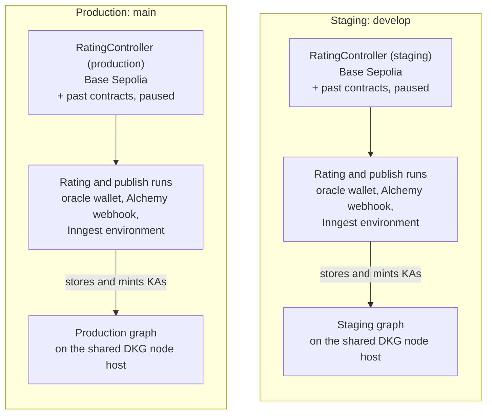
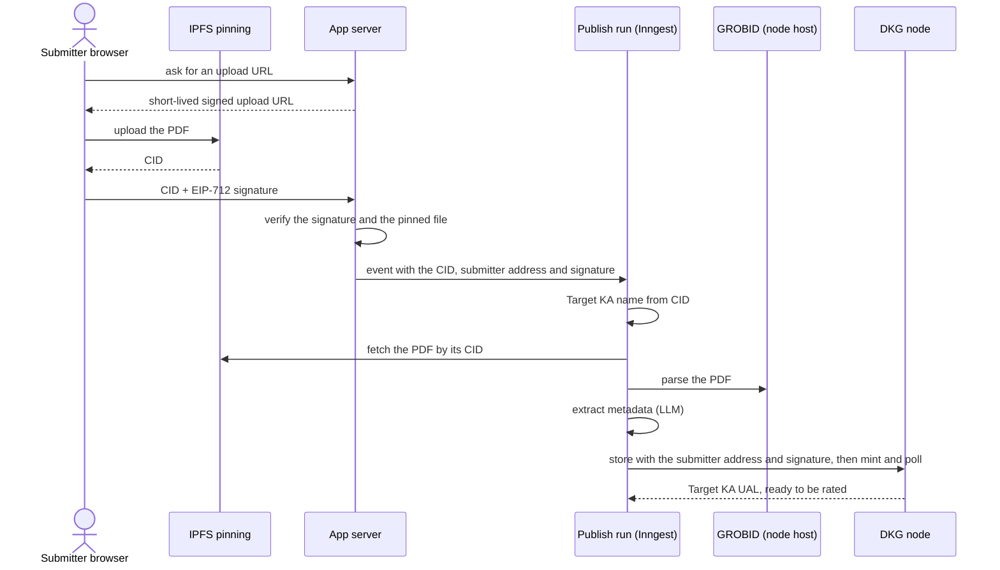
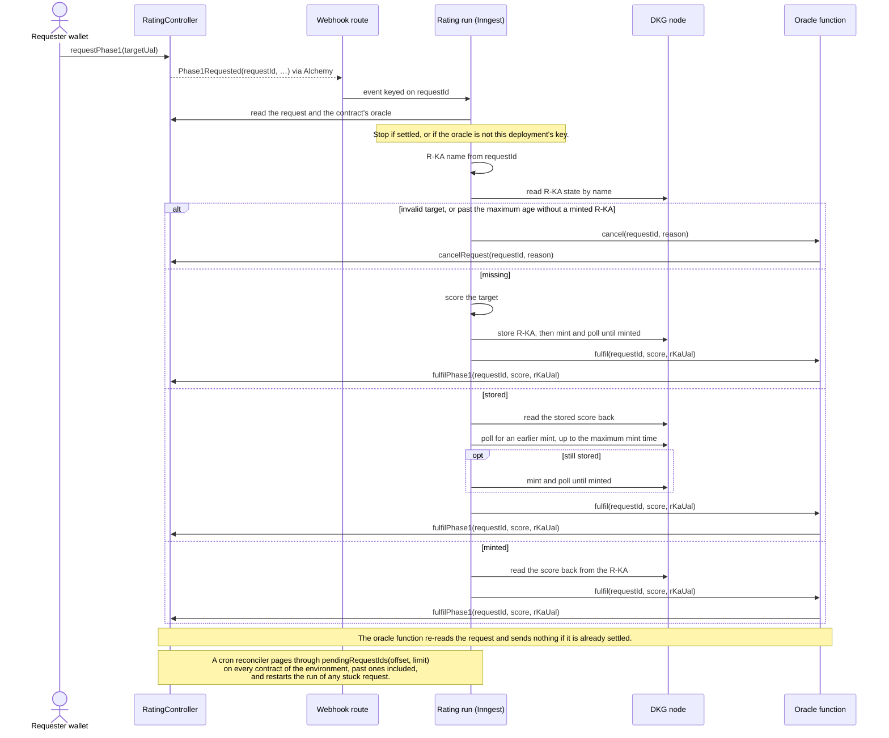

# verisci

[](https://github.com/SiegfriedBz/verisci/actions/workflows/ci.yml)

verisci gives scientific papers an open quality rating that anyone can request,
read and verify.

## Why

How much to trust a paper is usually inferred from where it was published, and
the reviews behind that judgement are rarely public. verisci attaches the
rating to the paper itself, in the open: each rating is a public record on the
OriginTrail Decentralized Knowledge Graph (DKG), and its score is written on
chain, so neither can be quietly changed. A rating starts as a rough machine
score and is meant to grow stronger through human review and, later, wet-lab
replication ([ADR 0012](docs/adr/0012-three-phases-settled-by-the-oracle.md)).

Status: early. verisci is a rebuild of an earlier prototype,
desci-rating-dapp, which ran both flows (publish a paper, rate it) end to end on
Base Sepolia. This repo starts again from clean foundations (monorepo, tooling,
CI), and its ADRs and domain facts record what the prototype taught us. No
user-facing feature has shipped here yet. Everything runs on testnets.

## How it works

- **A paper becomes a Target KA.** Its submitter signs it with their wallet; the
  PDF is parsed, its metadata extracted, and it is published to the DKG as a
  Knowledge Asset that records who submitted it
  ([ADR 0010](docs/adr/0010-pdf-to-target-ka-pipeline.md)).
- **Anyone can request a rating on chain.** verisci scores the paper, our DKG
  node publishes the rating as its own Rating KA (R-KA), and the oracle records
  the score on the contract ([ADR 0011](docs/adr/0011-a-rating-is-a-separate-r-ka.md),
  [ADR 0014](docs/adr/0014-contract-owns-scores-dkg-owns-content.md)).
- **Every write is safe to retry.** Each step checks what is already done
  before acting, so a retry never duplicates anything
  ([ADR 0007](docs/adr/0007-all-writes-converge.md)).
- **A cron job restarts anything stuck**, from the contract's own list of
  pending requests, and that request's run finishes or cancels it
  ([ADR 0020](docs/adr/0020-stuck-requests-recovered-only-oracle-cancels.md)).
- **Staging and production are kept apart**, with their own contracts, graphs
  and oracle wallets; only the DKG node is shared ([ADR 0005](docs/adr/0005-staging-and-production-are-isolated.md)).

Terms: a **KA** (Knowledge Asset) is a record on the DKG; the ones verisci
publishes (Target KAs and every R-KA) are minted and owned by its DKG node. The
**oracle** is verisci's account that records rating
results on the contract.

## Architecture

The diagrams below show the target design; the workspaces build it plan by plan.

### Environments and resources

Each environment has one context graph on the shared DKG node
([ADR 0005](docs/adr/0005-staging-and-production-are-isolated.md)). Our node
publishes the ratings of every contract of an environment to that environment's
graph, so a redeployed contract keeps the graph of the one it replaces; the old
contract is paused and drained ([ADR 0023](docs/adr/0023-a-fix-is-a-redeploy-owner-powers-fixed.md)).
Each contract's R-KA names are its own, because the request id hashes the chain
id and contract address ([ADR 0016](docs/adr/0016-asset-names-derive-from-request-id.md)).

The DKG node runs on its own server, with GROBID and an RPC proxy
([ADR 0006](docs/adr/0006-dkg-node-runs-on-a-dedicated-host.md)). The node reads
Base Sepolia only through that proxy, [`infra/rpc-proxy`](infra/rpc-proxy/README.md),
which asks free public endpoints first and keeps Alchemy within a daily budget.
Each environment also has its own oracle wallet, Alchemy webhook and Inngest
environment. Only `develop` holds staging's oracle key and runs its ratings;
previews and local development share staging's contract and graph, and a
developer running the rating functions locally uses their own contract and
oracle key ([ADR 0019](docs/adr/0019-oracle-transactions-are-serialized.md)).



### Publishing a paper



Every PDF goes through one uploader with fixed IPFS import settings, so the same PDF always
has the same CID and publishing it again converges on the existing Target KA ([ADR 0010](docs/adr/0010-pdf-to-target-ka-pipeline.md)).

### Rating a paper



Every run reads the request on chain and its R-KA on the node, then does what
is left: a retry, or a run restarted by the reconciler, recomputes the same name
from the request id and converges on the same R-KA
([ADR 0007](docs/adr/0007-all-writes-converge.md), [ADR 0017](docs/adr/0017-chain-events-are-ingested-at-least-once.md),
[ADR 0020](docs/adr/0020-stuck-requests-recovered-only-oracle-cancels.md)). A run
that finds an R-KA stored by an earlier run polls for a mint still in flight
and mints only if the R-KA is still stored
([ADR 0008](docs/adr/0008-mints-are-async-polled-in-short-steps.md)). Every
fulfil and cancel goes through the one serialized oracle function, which reads
the request again and sends nothing if it is already settled
([ADR 0019](docs/adr/0019-oracle-transactions-are-serialized.md)); a target UAL
that is invalid or not in canonical form is cancelled
([ADR 0031](docs/adr/0031-uals-are-normalized-before-the-contract.md)). The
contract's calls and events are documented in the
[`@verisci/contracts` README](packages/contracts/README.md).

## The repo

A pnpm and Turborepo monorepo: a Next.js app, five internal packages, and the
RPC proxy that runs on the DKG node server (`infra/rpc-proxy`). Packages ship
TypeScript source, with no build step; Next.js compiles them through
`transpilePackages`, and the server runs the proxy's source with plain Node.

## Requirements

- Node 24.15 or later within 24.x; `.nvmrc` pins 24.21.0, which CI uses.
  `pnpm install` refuses anything outside `>=24.15 <25`.
- Corepack, which provides the pnpm version pinned in `packageManager`.
- `jq`, used by the Claude Code hooks in `.claude/hooks/`.
- [Foundry](https://getfoundry.sh) 1.8.4 (`foundryup --install 1.8.4`). Needed for
  `packages/contracts`, and by `pnpm check` and `pnpm test`, which call `forge`.

## Getting started

```sh
corepack enable
pnpm install
(cd packages/contracts && forge soldeer install)   # Solidity dependencies
pnpm dev         # starts apps/web on http://localhost:3000
```

Environment variables are listed in [`.env.example`](.env.example): copy it to
`.env.local` at the repo root (gitignored), where `apps/web` loads it from.
`pnpm dev` and `pnpm test` run without it; `pnpm build` needs `APP_ENV`
(`APP_ENV=local`). How workspaces declare and validate them is in the
[`@verisci/env` README](packages/env/README.md).

## Commands

| Command | What it does |
| --- | --- |
| `pnpm check` | Biome format, lint and import order; then `forge fmt --check`, `forge lint` (any warning or note fails) and the NatSpec check in `packages/contracts` |
| `pnpm check:fix` | Biome rewrites what it can fix safely |
| `pnpm typecheck` | `tsc` in every workspace |
| `pnpm test` | Vitest in every workspace, plus `forge test` in `packages/contracts` |
| `pnpm test:coverage` | Vitest across all workspaces with coverage thresholds: `core` ≥ 90% branches, the others ≥ 70% lines. Until real code lands, only files imported by tests count (see `vitest.config.ts`) |
| `pnpm vitest related <file> --run` | Only the tests that touch `<file>` |
| `pnpm build` | Builds `apps/web`; needs `APP_ENV` (from the root `.env.local`, or `APP_ENV=local pnpm build`) |

`typecheck`, `test` and `build` run through Turbo, which caches results by
input. Biome and coverage run once at the root.

## CI

Every PR into `develop` or `main`, and every push to them, runs
[`.github/workflows/ci.yml`](.github/workflows/ci.yml) with two parallel jobs:

- `ts`: `biome ci`, `typecheck`, `test:coverage` (report uploaded as an
  artifact), `build` (with `APP_ENV=local`)
- `contracts`: Soldeer install, `forge fmt --check`, `forge lint` and NatSpec,
  `forge build --sizes`, a check that the committed ABI matches the contract,
  `forge test` with the `ci` profile (5000 fuzz runs)

## Decisions and domain facts

Architecture decisions are in [`docs/adr/`](docs/adr/README.md); facts about the DKG,
chain, Inngest, Vercel and tooling are in [`docs/domain.md`](docs/domain.md).

## Workspaces

| Workspace | What it is | Depends on |
| --- | --- | --- |
| [`apps/web`](apps/web/README.md) | Next.js app | all five packages |
| [`packages/env`](packages/env/README.md) | Typed environment variables | none |
| [`packages/core`](packages/core/README.md) | Domain logic, no IO | none |
| [`packages/dkg`](packages/dkg/README.md) | DKG adapter | core, env |
| [`packages/contracts`](packages/contracts/README.md) | Solidity contracts and their TypeScript side | core, env |
| [`packages/agents`](packages/agents/README.md) | Inngest workflows | core, env, dkg, contracts |
| [`infra/rpc-proxy`](infra/rpc-proxy/README.md) | JSON-RPC proxy run on the DKG node server | none |

Each workspace may only import the workspaces it declares. pnpm does not
hoist undeclared workspace packages, so breaking this rule fails `pnpm
typecheck`.

## Environments

`develop` is staging and `main` is production, both on testnets for now, with
separate resources ([ADR 0005](docs/adr/0005-staging-and-production-are-isolated.md)). Feature
PRs target `develop`; release PRs move `develop` into `main`. Details are in
[CONTRIBUTING.md](CONTRIBUTING.md#environments).

## Working with Claude Code

[`CLAUDE.md`](CLAUDE.md) and one `CLAUDE.md` per workspace give Claude Code the project
rules. `.claude/` holds the shared settings, hooks and skills:

| Skill | What it does |
| --- | --- |
| `/plan-feature <name>` | Writes `docs/plans/NNN-<name>.md` from the plan template |
| `/implement <NNN>` | Branches from `develop`, writes the tests first, then implements until green |
| `/review-branch` | Runs CI's checks, tests and builds, then a read-only review; blocks on any failure, stale docs or ADR conflict, then drafts the PR |
| `/review-adrs` | On demand: checks every ADR against every other and reports conflicts for the maintainer to decide |

Hooks format, lint and test each file Claude edits, block edits to generated files and
reads of env files (except `.env.example`), and typecheck the changed workspaces and the
workspaces depending on them before Claude finishes. They need `jq`. Permission rules deny
`git push` and the usual deploy commands (`forge script --broadcast`, `forge create`,
`cast send`); `git commit` asks first. These rules match how a command is written, so they
are guard rails, not a sandbox. Personal overrides go in `.claude/settings.local.json`
(gitignored).

## Contributing

Branches, commits, docs rules, pull requests and releases are covered in
[CONTRIBUTING.md](CONTRIBUTING.md). verisci is built with
[Claude Code](https://claude.com/claude-code).

## License

[MIT](LICENSE)
