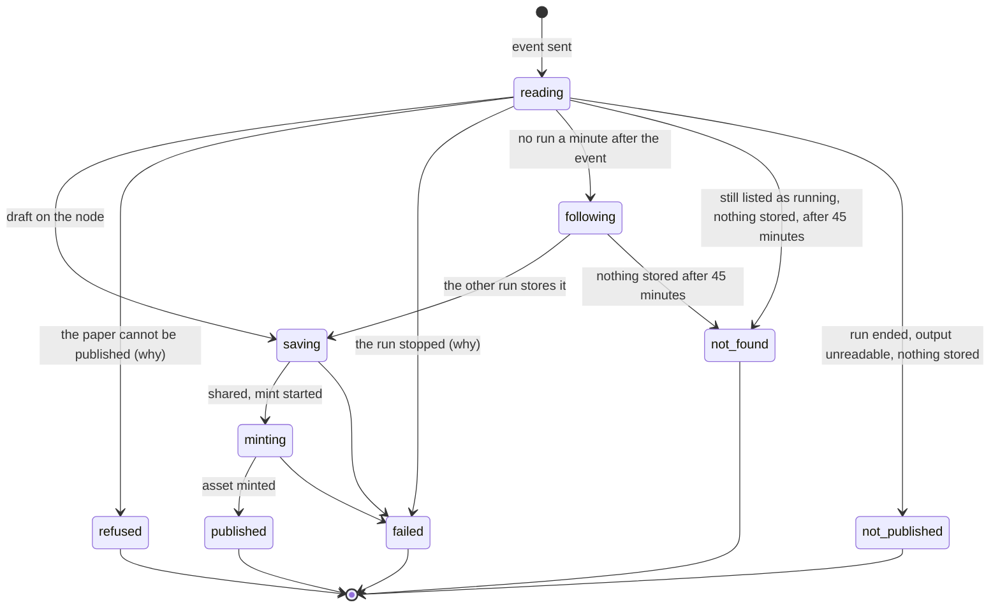

# @verisci/web

The Next.js 16 app (App Router).

Status: the upload pages, where a visitor connects a wallet, publishes a PDF and follows it
until its Target KA is minted, plus `/api/inngest`, which serves the agents' Inngest
functions ([ADR 0003](../../docs/adr/0003-inngest-workflows-live-in-agents.md)). A production
build validates the shared variables: `build` needs `APP_ENV` (see the
[`@verisci/env` README](../../packages/env/README.md)).

## Pages and routes

| Path | What it is |
| --- | --- |
| `/` | Home: what VeriSci does, the DKG's two layers (the record off-chain, its ERC-721 token and merkle root on-chain, the UAL linking them), how publishing works and the rating flow to come, and an example paper asset |
| `/publish` | Connect a wallet, drop a PDF, sign once; what publishing means and the limits ([ADR 0010](../../docs/adr/0010-pdf-to-target-ka-pipeline.md), [ADR 0034](../../docs/adr/0034-users-connect-a-wallet-anyone-may-publish.md)) |
| `/papers/<cid>?event=<id>` | Where a paper stands, then its record and how to verify it (below). `?already=1` says a re-submitted PDF was already published |
| `/api/papers/<cid>?event=<id>` | The same as JSON (`PaperView`: the stage, and the record once published), never cached: a read, so a route rather than a server action |
| `/api/inngest` | Serves the Inngest functions |
| any other path | `app/not-found.tsx`; a page that fails to render shows `app/error.tsx` with a retry |

The publish form calls two server actions (`app/actions.ts`): `requestUpload()` signs a
Pinata upload URL within the connection's daily limit, and `submitPaper(input)` checks the
signed submission and starts its publish run within the address's daily limit
([ADR 0035](../../docs/adr/0035-limits-are-the-apps-only-state.md)). The browser uploads the
PDF straight to Pinata, canonicalizes the CID it answers, and has the wallet sign
`{ cid, contextGraph, deadline }` with a deadline 10 minutes ahead. The work itself is
`@verisci/agents`' `getUploadService()` ([`packages/agents`](../../packages/agents/README.md#the-upload-pages-calls)).

Limits (`lib/limits.ts`): 10 upload URLs per connection (IP) and 5 submissions per signing
address, each per rolling day, in Upstash; in memory with `APP_ENV=local` and no Upstash
settings, reset when the server restarts. A limit store that does not answer refuses
rather than letting requests through.

### The paper page

`components/paper-progress.tsx` asks `/api/papers/<cid>` every 5 s and stops on a final
stage; it shows and asks by the CID's canonical spelling, the one the signature covers,
whatever spelling the address has. `lib/progress.ts` (`paperProgress`, pure) maps the asset's state on the node, the
run Inngest started for the event, and why that run stopped to one stage:

- A minted asset is `published` whatever the run says, so a second submitter of the same
  PDF sees it at once.
- `refused` shows why (`lib/messages.ts` → `refusalMessage`): not a PDF, too large,
  unreadable, no title (with a hint for PDFs whose pages are pictures), or a submission
  that failed its checks.
- `failed` shows why the run stopped (`failureMessage`): Base, the PDF, the DKG node or
  the mint not answering after every retry, or a problem on our side.
- `following`: the event started no run a minute after it was sent (its time is read from
  its ULID, `eventTime`). The publish function is a singleton per CID, so another run holds
  this PDF; the page follows the paper on the node and gives up (`not-found`) after
  `FOLLOW_MS`, a run's whole 45-minute budget.
- `not-found` also covers a page with no event to ask about and nothing on the node, and a
  run still listed as running after `FOLLOW_MS` with nothing on the node: Inngest cancels a
  run at its finish timeout.
- `unavailable` (the node or Inngest not answering) is shown and asked again.
- A published paper whose record the node did not answer for, or does not show yet after
  its run minted it (`recordProblem: "unavailable"`), is asked about again until the record loads; one whose record cannot be
  read says so (ADR 0021).

Once published, the page shows the record (title, authors, DOI) and a "Verify it
yourself" panel (`components/verify-panel.tsx`): the signature checked when read, the
submitter, the signature, its deadline and the context graph, the EIP-712 domain and type
to check it with, the address the asset was minted to, the asset's ERC-721 token in
OriginTrail's `DKGKnowledgeAssets` (`lib/explorer.ts` → `assetTokenUrl`), the UAL, and the
PDF's CID, linked through Pinata's public gateway (`ipfsUrl`; ipfs.io no longer serves
files). Addresses and the token link to Basescan.

## Design

A dark lab instrument with a web3 edge, in Tailwind CSS v4 (`app/globals.css`):

- Near-black, glass panels with hairline borders, a faint grid, one glow behind the hero.
  Dark only.
- Two signal colours with one meaning each: emerald for the off-chain record, cyan for the
  on-chain asset. They blend only on the main action, live lines, and the line linking a
  save to its mint in the publish chain.
- Sora for text, Martian Mono for on-chain values (`next/font`), Phosphor icons. One radius
  scale: `rounded-2xl` panels, `rounded-xl` buttons and inputs, `rounded-lg` small
  controls, `rounded-md` flags.
- Motion: the home page plays the publish chain on a loop and the step being worked on
  breathes; all of it stops for visitors who ask for reduced motion.
- Every page works from 360 px wide, one column on phones, and the page clips any overflow.
  On-chain values show in short form with a copy button.
- The product name is VeriSci; its mark (`components/logo.tsx`, and `app/icon.svg` for the
  tab) is a check drawn as three linked graph nodes.
- Keyboard users get a skip link and one accent focus ring; the header marks the current
  page.
- The footer (`components/site-footer.tsx`) lists the contracts on Base Sepolia, linked on
  Basescan: OriginTrail's `DKGKnowledgeAssets` and `KnowledgeAssetsLifecycle`
  (`ORIGINTRAIL_CONTRACTS` from `@verisci/core`), and this environment's RatingController
  from `@verisci/contracts` (`local` shows staging's).

## Depends on

All five packages: `@verisci/env`, `@verisci/core`, `@verisci/dkg`,
`@verisci/contracts`, `@verisci/agents`. Each one must be listed in
`transpilePackages` in `next.config.ts`. Also `inngest` (the `/api/inngest` route's `serve`
handler); Reown AppKit, wagmi, viem and TanStack Query (the wallet); `@upstash/ratelimit`
and `@upstash/redis` (the limits); Tailwind CSS and Phosphor icons. `next.config.ts` points
the optional `@x402/*` packages, reached through wagmi's connectors, at `lib/empty-module.ts`
(`docs/domain.md` → Next.js).

## Environment

`next.config.ts` loads env files from the repo root (`.env.local` and friends; see
[`.env.example`](../../.env.example)). Keep them there, not in `apps/web`: Next.js
would mix the two unpredictably when it reloads. Next.js only watches `apps/web`,
so restart `pnpm dev` after editing a root env file. Variables already set in the
environment (CI, the host) take precedence.

Its own settings are declared in `lib/web-env.ts` (`createWebEnv`), all three required
unless `APP_ENV` is `local`:

| Variable | Value |
| --- | --- |
| `UPSTASH_REDIS_REST_URL`, `UPSTASH_REDIS_REST_TOKEN` | Upstash Redis's REST address and token, for the limits: one database per environment, previews using staging's ([ADR 0005](../../docs/adr/0005-staging-and-production-are-isolated.md)). The token is secret |
| `REOWN_PROJECT_ID` | The Reown project id for the wallet window, from one project shared by every environment, read on the server and handed to the page, so nothing is inlined at build time. Without it the pages say the wallet is not set up |

The pages also need the agents' settings (DKG, Pinata, chain, Inngest;
[`packages/agents`](../../packages/agents/README.md#environment)). With `APP_ENV=local`,
`/api/inngest` and the upload page talk to the Inngest dev server. `instrumentation.ts`
checks the agents' and the web app's settings when a deployed server starts, so a bad one
stops it there. It checks nothing when `APP_ENV` is `local`, and does not run during
`next build`. On Vercel, a server starts on a request after the deploy is live, so a
missing setting makes every route fail: set them in each Vercel environment before its
first deploy, and allow each deployed domain in the Reown project.

## Scripts

| Command | What it does |
| --- | --- |
| `pnpm --filter @verisci/web dev` | Starts the dev server on http://localhost:3000 |
| `pnpm --filter @verisci/web build` | Production build; needs `APP_ENV` (from the root `.env.local` locally) |
| `pnpm --filter @verisci/web start` | Serves the production build |
| `pnpm --filter @verisci/web inngest` | Starts the Inngest dev server (http://localhost:8288), pointed at `/api/inngest`; run it next to `dev` |
| `pnpm --filter @verisci/web typecheck` | Generates Next's types (`next typegen`), then runs `tsc` |
| `pnpm --filter @verisci/web test` | Runs its Vitest project (`vitest run`) |
